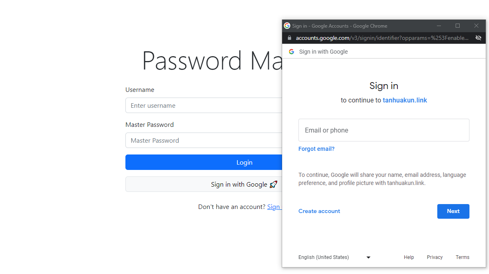
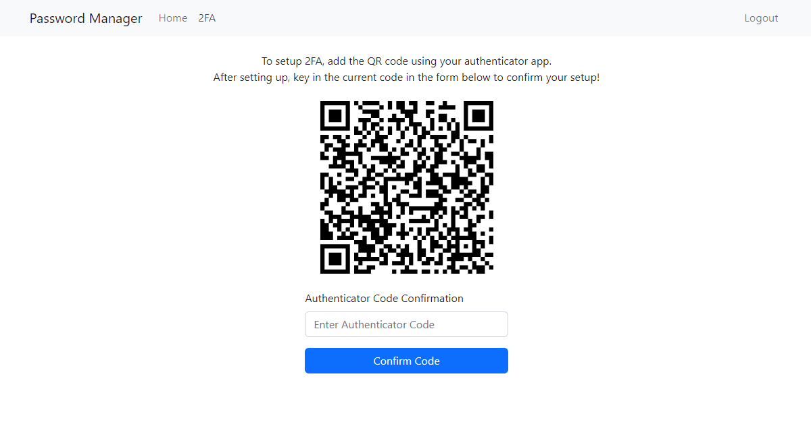

## Table Of Contents
- [Introduction](#introduction)
- [App Features](#app-features)
- [Motivation](#motivation)
- [App Design](#app-design)
  * [Master Password](#master-password)
  * [Authenticated Requests](#authenticated-requests)
  * [Client Side Password Encryption](#client-side-password-encryption)
  * [2FA Implementation](#2fa-implementation)
  * [AWS Deployment](#aws-deployment)
  * [Secrets](#secrets)
- [Lessons Learned / Room For Improvement](#lessons-learned---room-for-improvement)
- [Local Deployment Using Docker Swarm](#local-deployment-using-docker-swarm)
  * [Commands:](#commands-)
  * [Creating 256-bit Base64 key for jwt_token:](#creating-256-bit-base64-key-for-jwt-token-)
  * [Possible Issues:](#possible-issues-)
- [Screenshots](#screenshots)

## Introduction

This is a password manager web application, made with React + Nginx frontend, Rust backend, MySQL database and Redis cache.

This repository includes CI/CD Github actions for running automated tests and deploying to Amazon ECS.

It is also possible to deploy the password manager locally using docker.

## App Features

* Sign in with Google OAuth
* Google/Microsoft Authenticator Compatible TOTP Implementation (2FA)
* Client-side password encryption

## Motivation

I started on this project to learn more of the following:
* The Rust programming language.
* Using OAuth and 2FA in applications.
* Applying cryptographic libraries.
* Setting up of CI/CD pipelines.

## App Design

### Master Password
* Regardless of the signing up method, the user has to provide a master password.
* The client sends a hash of the master password to the server.
* The server treats the hash as if it was the password, hashing it again before storing and using it for authentication.

### Authenticated Requests
* JWT access and refresh tokens are used to handle sending requests to protected routes.
* CSRF tokens are placed within the JWT access token as well as a HTTP header in a Double Submit Cookie Pattern.

### Client Side Password Encryption
* The master password is used to derive a key using the PBKDF2 algorithm.
* Passwords are encrypted using AES-GCM and the derived key above, and sent to the server.
* These passwords can only be decrypted by the client who knows the master password.

### 2FA Implementation
* 2FA codes are generated using the Time-Based One-Time Password Algorithm (TOTP) as specified in RFC 6238.
* However, only one default setting is used (SHA1, 30 seconds interval and 6 digit code), as these are the settings supported by Google Authenticator.

### AWS Deployment
* The frontend (Nginx and React) and backend (Rust) are built into their own docker images and pushed to ECR.
* Amazon ECS is used to deploy these containers.
* Amazon RDS (MySQL) and Elasticache are used in for DB and Redis respectively.

### Secrets
* In the local deployment via docker, a local_setup script is used to pass in secrets to be stored in the docker swarm.
* In the AWS deployment, AWS Secrets Manager is used to store secrets.

## Lessons Learned / Room For Improvement
* Testing in Rust can be done more effectively with tools such as mockall.
* Rust may not be the best for an AWS deployment because there is no production-ready AWS SDK for Rust.
* The current method implemented for revoking JWT tokens ( revoking via timestamp ) would logout the user on every device.

## Local Deployment Using Docker Swarm 

### Commands:

**Prerequisites** <br>
* Clone this repository.
* Ensure that docker is installed, use sudo in front of Linux commands if required.

**Start a docker swarm manager node** <br>
`docker swarm init`

**Run given script to setup docker secrets, set google client ID for frontend and build service images** <br>
Linux: `./scripts/local_setup.sh` <br>
Windows: `.\scripts\local_setup.ps1`

*Note: Methods for generating a base64 key for jwt token can be found in the next section.*

**Deploy with google client ID argument** <br>
Linux: `./scripts/local_deploy.sh <GOOGLE_CLIENT_ID>` <br>
Windows: `.\scripts\local_deploy.ps1 <GOOGLE_CLIENT_ID>`

*Note: Google Client ID is used for signing in with Google, and looks something like this XXXXX-XXXXXXXXXXXXXX.apps.googleusercontent.com. Set it to a random string (for example 'aaaa') if you do not want to use the sign in with Google feature.*

**Usage** <br>
Visit http://localhost:8080 to interact with password manager

**Teardown** <br>
`docker stack rm password-manager`

### Creating 256-bit Base64 key for jwt_token:

**Linux:** <br>
```
openssl rand -base64 32
```

**Windows Powershell:** <br>

```
$randomBytes = New-Object -TypeName Byte[] 32

$rngCryptoServiceProvider = New-Object -TypeName System.Security.Cryptography.RNGCryptoServiceProvider

$rngCryptoServiceProvider.GetBytes($randomBytes)

[Convert]::ToBase64String($randomBytes)
```


### Possible Issues:

1. Data volume of mysql might cause issues if the mysql user and password was changed. At the risk of losing all your passwords, run `docker volume rm password-manager_my-datavolume` to remove the old volume. 


## Screenshots
Login page with sign-in with google option.


Main password dashboard.


Adding passwords with option to automatically generate a password with desired length.


2FA setup page with QR code scanning.
